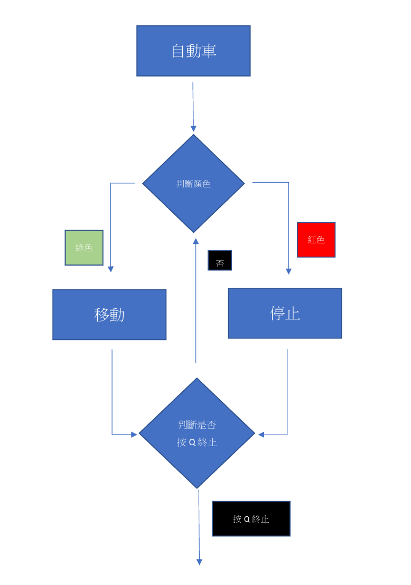

# Raspberry Pi Autonomous Traffic Light Car (樹莓派影像辨識自動車)

這是一個基於 **Raspberry Pi** 結合 **OpenCV** 影像辨識的自動駕駛模擬專案。小車能夠透過 Webcam 即時識別紅綠燈號誌，並自動執行對應的行駛策略（前進/停止），同時具備語音播報功能。

> **專案說明**: 本專案為大學時期的三人團隊作品。我主要負責 **自動車控制邏輯 (GPIO)**、**語音系統整合 (TTS)** 以及軟硬體整合測試。

---

## 功能特色 (Features)

* **自動號誌識別**: 透過 Webcam 捕捉影像，即時判斷紅燈或綠燈。
* **智慧行駛決策**:
    * 🟢 **綠燈**: 系統發出 "Go" 語音提示，並驅動馬達前進。
    * 🔴 **紅燈**: 系統發出 "Stop" 語音提示，並強制車輛停止。
* **語音互動 (Text-to-Speech)**: 整合 `gTTS` 庫，讓車輛能以語音回饋當前狀態。
* **模組化控制**: 將馬達控制封裝為函式，便於邏輯呼叫。

---

## 技術棧 (Tech Stack)

* **Language**: Python 3
* **Hardware**: Raspberry Pi 3/4, L298N Motor Driver, DC Motors.
* **Libraries**:
    * `RPi.GPIO`: 負責 GPIO 腳位的高低電位控制 (負責部分)。
    * `gTTS` (Google Text-to-Speech): 負責狀態語音生成 (負責部分)。
    * `opencv-python`: 負責影像處理與顏色遮罩 (協作部分)。

---

## 系統架構與職責 (System Architecture & Roles)

本專案由三人協作完成，我的職責聚焦於 **「決策執行層」** 與 **「反饋層」**：

### 1. 自動車控制邏輯 (My Contribution)
負責編寫 Python 腳本控制 L298N 馬達驅動模組。
* 定義 `forward()`, `stop()`, `turnRight()` 等函式，透過 `GPIO.output` 控制 Pin 11, 13, 16, 18 的電位變化。
* 實作主迴圈 (`while True`) 邏輯：接收影像辨識組件傳來的 `green_light` / `red_light` 布林值，即時切換車輛狀態。

### 2. 語音系統整合 (My Contribution)
為了增加互動性，我引入了 `gTTS` 套件。
* 在狀態改變時（如紅燈變綠燈），動態生成或播放預存的 MP3 檔案 (`go.mp3`, `stop.mp3`)。
* 使用 `os.system('omxplayer ...')` 指令透過樹莓派音源孔輸出聲音。

### 3. 影像辨識 (Team Collaboration)
* 隊員負責實作 OpenCV 演算法，將影像轉為 HSV 色彩空間並設定 Threshold 來過濾紅/綠色塊。
* 我們共同解決了環境光造成的色偏問題，透過調整 HSV 參數提升了辨識準確率。

---

## 硬體腳位定義 (Pin Definitions)

本專案程式碼中定義的 GPIO 腳位配置如下：

| L298N 腳位 | Raspberry Pi GPIO (Board Mode) | 功能描述 |
| :--- | :--- | :--- |
| IN1 | Pin 16 | 右輪馬達控制 A |
| IN2 | Pin 18 | 右輪馬達控制 B |
| IN3 | Pin 11 | 左輪馬達控制 A |
| IN4 | Pin 13 | 左輪馬達控制 B |

---

## 程式執行流程 (Logic Flow)

系統啟動後會先處於 `prepare` 狀態，待 OpenCV 偵測到綠燈訊號後，進入主控制迴圈。

> **圖一：系統邏輯流程圖**
> 展示了從顏色判斷到移動/停止的決策過程。

---

## 專案文件
更多關於專案的詳細報告，請參閱：
* [完整專案報告 (Project_Report.pdf)](./docs/Project_Report.pdf)

---
